# Gintautas Movie Recommendation (VCS GMR)

## Description
Gintautas Movie Recommendation (GMR) is a project that scrapes, cleans, and clusters movie data from IMDB to build and compare a recommendation system. The project applies machine learning techniques such as clustering and natural language processing (NLP) to recommend movies based on various features like rating, length, metascore, and user reviews.

## Installation
1. **Clone the Repository**
   ```bash
   git clone https://github.com/GintautasLuksas/GMR.git
   cd VCS_GMR
   ```

2. **Install Required Dependencies**
   ```bash
   pip install -r requirements.txt
   ```

3. **Run the Scraping Script**
   ```bash
   python scrape_data.py
   python additional_scrape.py
   ```

4. **Merge and Clean Data**
   ```bash
   python merge.py
   python cleaning.py
   ```

5. **Normalize Data**
   ```bash
   python normalize.py
   ```

6. **Run Regular and Embeded Clustering**
   ```bash
   python comparison.py
   python encode_comparison.py
   ```

7. **Run Regular and Enbeded Clustered Data with Random Forest**
   ```bash
   python random_forest.py
   python embeded_random_forest.py
   ```

8. **Run Regular and Embeded Clustering**
   ```bash
   python cosing_euclidean.py
   python embeded_cosing_euclidean.py
   ```

## Project Structure
```
VCS_GMR/
│── src/
│   ├── main/
│   │   ├── clean/             # Data cleaning scripts
│   │   ├── recommendation/    # Clustering and recommendation analysis
│   │   ├── recommendation_embeded/ # Embeded data comparison scripts
│   │   ├── encode/            # Encoding and processing numerical columns
│   │   ├── normalize_comparison/ # Normalization and comparison analysis
│   │   ├── random_forest/     # Random forest model implementations
│   │   ├── scrape/            # Web scraping and data collection
│   │   ├── system_test_data/  # Testing dataset handling
│── .gitignore
│── README.md
│── requirements.txt
```

## Project Evaluation

### Scraping
- **`scrape_data.py`** scrapes IMDB with filters set for movies rated 9.9 - 7.0, with at least 10,000 user ratings.
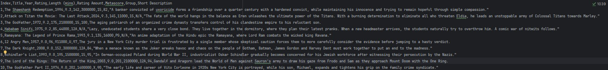


- **`additional_scrape.py`** collects additional data by pressing the 'info' button, including Directors, Stars, and Genres.
- 2400 complete movies were scraped.
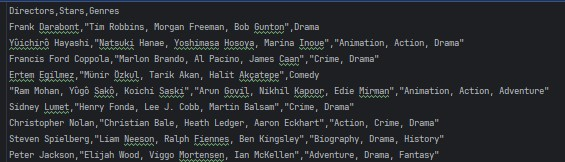

- **`merge.py`** merges `imdb_movies.csv` and `additional_data.csv` to create `complete_data.csv`.

### Cleaning
- **`cleaning.py`** loads the dataset, performs cleaning operations, and saves the cleaned data.
- Stars and Genres are distributed into separate columns (up to 3 per movie).
- After cleaning, 1630 full records remain.
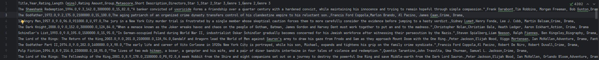

### Normalization
- **`normalize.py`** uses MinMaxScaler to normalize numeric columns: Year, Length (mins), Rating Amount, Rating, and Metascore.
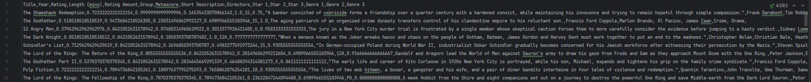

### Regular Clustering
- DBScan, K-Means, and Agglomerative Clustering were tested. DBScan failed and was excluded.
- **`comparison.py`** applies:
  - Elbow method and dendrogram to determine optimal clusters.
  - PCA for a 2D view.
  - Silhouette Score and Davies-Bouldin Score for evaluation.
  - **Chosen Clusters:** 3

  **Elbow Method Visualization:**
 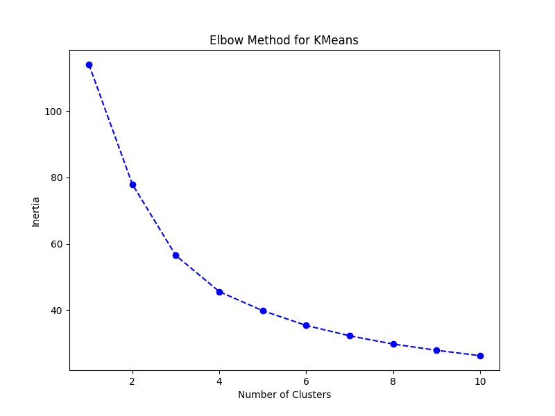

  **Dendrogram:**


- **Silhouette Scores:**
  - K-Means: **0.313**
  - Agglomerative: **0.281**

  **Silhouette Score Comparison:**
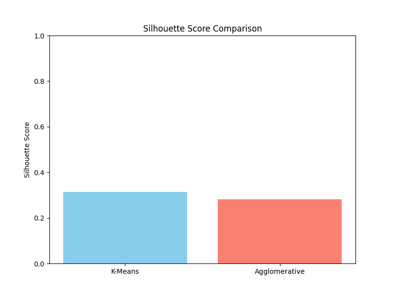

  **Cluster Visualization:**


- **Davies-Bouldin Score for KMeans (3 clusters):** **1.076**

 
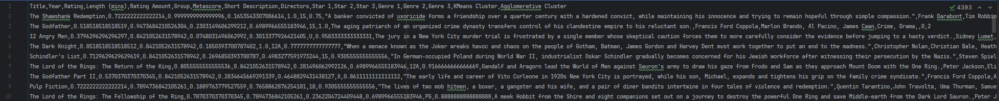


### Clustering with Embeded data
- Text columns (Title, Short Description, Directors, Stars, Group, Genre) are preprocessed.
- A pre-trained Sentence Transformer model (`all-MiniLM-L6-v2`) generates embeddings.
- Autoencoder neural network is built and trained.

  **Elbow Method & Dendrogram:**
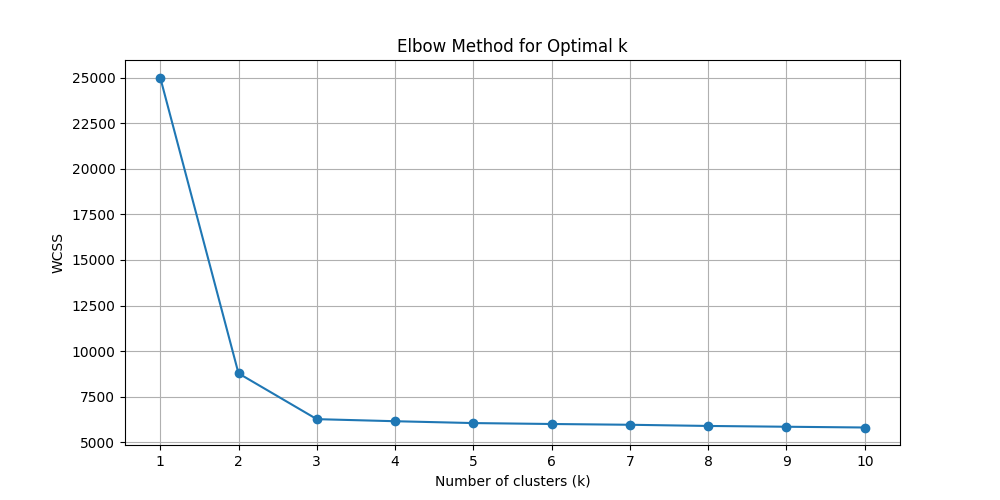

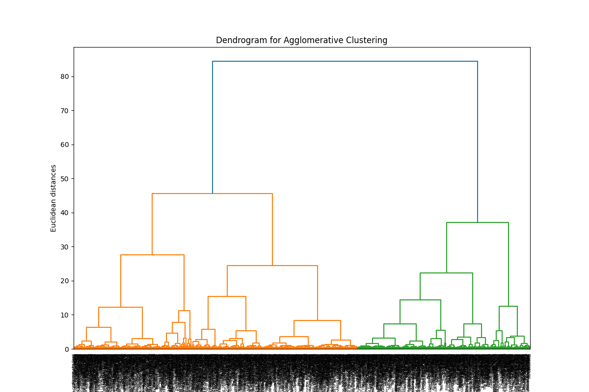


- **Silhouette Scores:**
  - K-Means: **0.4046**
  - Agglomerative: **0.3066**

  **Cluster Visualization:**
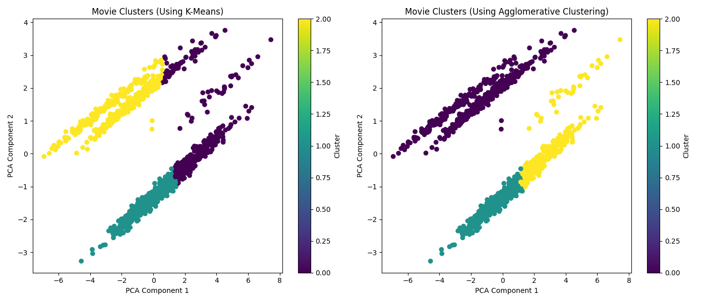


Clusters from encoded data
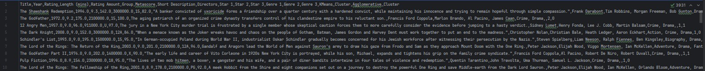

Embeded data with clusters
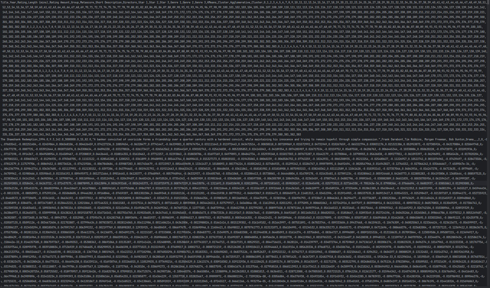


### Random Forest Classification
#### Regular Clustering
- **K-Means Performance:**
  - Accuracy: **0.60**
  - F1 Score: **0.60**
  - Precision: **0.62**
  - Recall: **0.60**
    
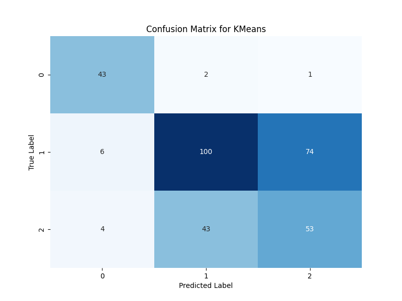


- **Agglomerative Performance:**
  - Accuracy: **0.73**
  - F1 Score: **0.74**
  - Precision: **0.75**
  - Recall: **0.73**
  
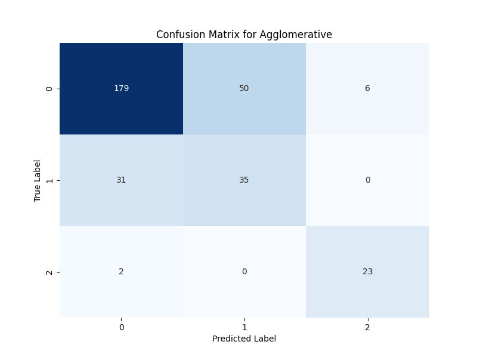


#### Embeded Random Forest
- **K-Means Performance:**
  - Accuracy: **0.49**
  - F1 Score: **0.49**
  - Precision: **0.50**
  - Recall: **0.49**
    
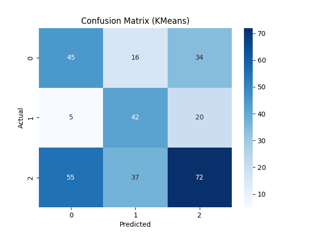


- **Agglomerative Performance:**
  - Accuracy: **0.55**
  - F1 Score: **0.55**
  - Precision: **0.55**
  - Recall: **0.55**
    
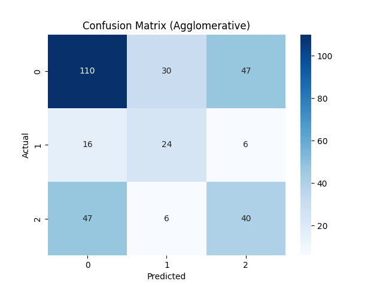


**Best Performing Clustering:** **Regular Agglomerative**

### Recommendation System
The model for user input immitation currently uses scraped data for movies released between 2014 and 2024 from IMDB page, with user ratings amount of 10,000 or more, to ensure a more diverse selection of films.
Data proccessed just like original dataset.


## Regular Recommendation
What uses created model for simmilar movie selection?
- Uses Agglomerative clusters as the primary similarity metric.
- Filters based on rating, Metascore, Genre, and numeric features.
- cosine_weight = 0.3
- euclidean_weight = 0.7

## Embeded Recommendation
- Uses embedded data for recommendations.
- cosine_weight = 0.3
- euclidean_weight = 0.7

## Model results Evaluation
Evaluation was done with ChatGPT.
- **Genre Match**: Verified via IMDb & Rotten Tomatoes.
- **Rating Proximity**: Compared across IMDb and Rotten Tomatoes.
- **Length Similarity**: Thresholds of ±5 and ±10 minutes.
- **Metascore**: Verified via Metacritic.
- **Thematic Alignment**: Based on reviews and summaries.
- **ChatGPT Insights**: AI-based movie context analysis.

**Agglomerative Clustering Weights:**

Genre Match (15): Important for aligning user preferences with movie types.
Rating Proximity (25): Highest weight due to its crucial role in matching user expectations based on audience ratings.
Length Similarity (15): Affects user experience; important but secondary to genre and ratings.
Thematic Alignment (10): Provides insight into how well a movie resonates with interests, but less critical than genre and ratings.
Metascore (15): Valuable for critical reception insights, reflecting its importance alongside ratings.
ChatGPT (20): Offers broader contextual understanding and trends, providing a unique perspective.

**Embedded Model Weights:**

Genre Match (20): Slightly more critical than in Agglomerative Clustering, ensuring alignment with user preferences.
Rating Proximity (10): Lower weight reflects reliance on deeper contextual understanding rather than explicit ratings.
Length Similarity (10): Maintains importance for user comfort with movie durations.
Thematic Alignment (20): Increased weight due to the model’s strength in recognizing themes and narratives.
Metascore (5): Lowest weight, indicating a focus on intrinsic qualities over aggregate scores.
ChatGPT (35): Highest weight, emphasizing insights from conversational AI to enhance recommendations.

Conclusion. The weight differences reflect each model's strengths: Agglomerative Clustering focuses on ratings and genres, while the Embedded Model emphasizes thematic understanding and AI insights.


**With Regular data**

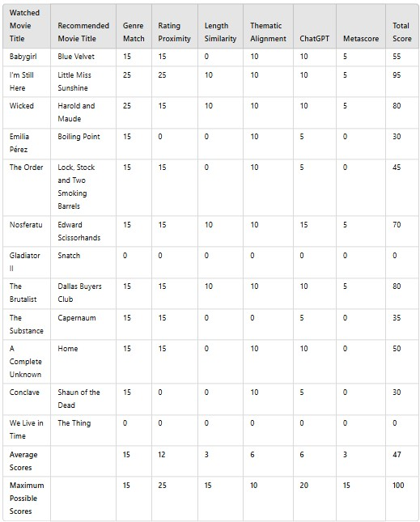

**With Embeded data**


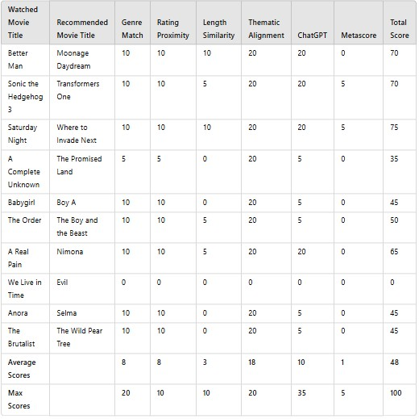


## Summary of Average Scores:
**Agglomerative Clustering:**

Genre Match: 15/15 (100%)
Rating Proximity: 12/25 (48%)
Length Similarity: 3/15 (20%)
Thematic Alignment: 6/10 (60%)
ChatGPT: 6/20 (30%)
Metascore: 3/15 (20%)
Total Score: 47/100 (47%)

**Embedded Model:**
Genre Match: 8/20 (40%)
Rating Proximity: 8/10 (80%)
Length Similarity: 3/10 (30%)
Thematic Alignment: 16/20 (80%)
ChatGPT: 10/35 (28.57%)
Metascore: 0/5 (0%)
Total Score: 48/100 (48%)


---

## Project Status
### **Completed Features:**
✔ Movie data scraping from IMDB  
✔ Data cleaning and preprocessing  
✔ Feature normalization  
✔ Clustering using K-Means and Agglomerative Clustering  
✔ Recommendation system based on clustering  
✔ Evaluation with Silhouette Score and Davies-Bouldin Index  

### **Future Improvements:**
- Expand dataset with more relevant columns (e.g., user & critic reviews).
- Enhance recommendation logic with deep learning models.
- Implement a web-based UI for user interaction.

---
**Developed by Gintautas | GMR**

