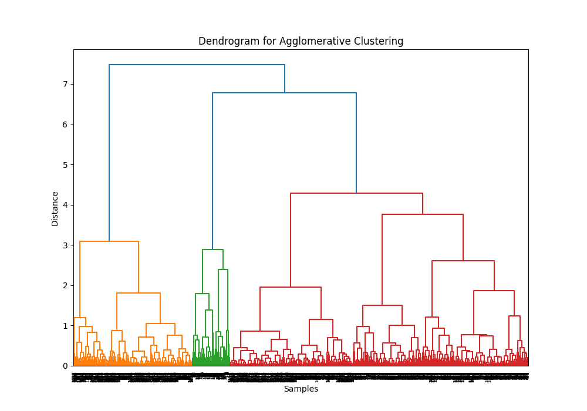
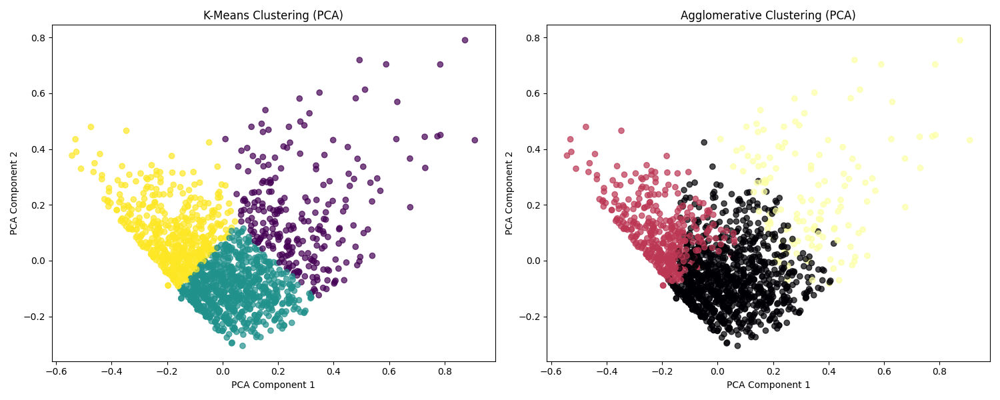

# Gintautas Movie Recommendation (VCS GMR)

## Description
Gintautas Movie Recommendation (GMR) is a project that scrapes, cleans, and clusters movie data from IMDB to build and compare a recommendation system. The project applies machine learning techniques such as clustering and natural language processing (NLP) to recommend movies based on various features like rating, length, metascore, and user reviews.

## Installation
1. **Clone the Repository**
   ```bash
   git clone https://github.com/GintautasLuksas/GMR.git
   cd VCS_GMR
   ```

2. **Install Required Dependencies**
   ```bash
   pip install -r requirements.txt
   ```

3. **Run the Scraping Script**
   ```bash
   python scrape_data.py
   python additional_scrape.py
   ```

4. **Merge and Clean Data**
   ```bash
   python merge.py
   python cleaning.py
   ```

5. **Normalize Data**
   ```bash
   python normalize.py
   ```

6. **Run Regular and Embeded Clustering**
   ```bash
   python comparison.py
   python encode_comparison.py
   ```

7. **Run Regular and Enbeded Clustered Data with Random Forest**
   ```bash
   python random_forest.py
   python embeded_random_forest.py
   ```

8. **Run Regular and Embeded Clustering**
   ```bash
   python cosing_euclidean.py
   python embeded_cosing_euclidean.py
   ```

## Project Structure
```
VCS_GMR/
│── src/
│   ├── main/
│   │   ├── clean/             # Data cleaning scripts
│   │   ├── recommendation/    # Clustering and recommendation analysis
│   │   ├── recommendation_embeded/ # Embeded data comparison scripts
│   │   ├── encode/            # Encoding and processing numerical columns
│   │   ├── normalize_comparison/ # Normalization and comparison analysis
│   │   ├── random_forest/     # Random forest model implementations
│   │   ├── scrape/            # Web scraping and data collection
│   │   ├── system_test_data/  # Testing dataset handling
│── .gitignore
│── README.md
│── requirements.txt
```

## Project Evaluation

### Scraping
- **`scrape_data.py`** scrapes IMDB with filters set for movies rated 9.9 - 7.0, with at least 10,000 user ratings.
- **`additional_scrape.py`** collects additional data by pressing the 'info' button, including Directors, Stars, and Genres.
- 2400 complete movies were scraped.
- **`merge.py`** merges `imdb_movies.csv` and `additional_data.csv` to create `complete_data.csv`.

### Cleaning
- **`cleaning.py`** loads the dataset, performs cleaning operations, and saves the cleaned data.
- Stars and Genres are distributed into separate columns (up to 3 per movie).
- After cleaning, 1630 full records remain.

### Normalization
- **`normalize.py`** uses MinMaxScaler to normalize numeric columns: Year, Length (mins), Rating Amount, Rating, and Metascore.

### Regular Clustering
- DBScan, K-Means, and Agglomerative Clustering were tested. DBScan failed and was excluded.
- **`comparison.py`** applies:
  - Elbow method and dendrogram to determine optimal clusters.
  - PCA for a 2D view.
  - Silhouette Score and Davies-Bouldin Score for evaluation.
  - **Chosen Clusters:** 3

  **Elbow Method Visualization:**
 

  **Dendrogram:**



- **Silhouette Scores:**
  - K-Means: **0.313**
  - Agglomerative: **0.281**

  **Silhouette Score Comparison:**


  **Cluster Visualization:**


- **Davies-Bouldin Score for KMeans (3 clusters):** **1.076**

### Clustering with Neural Network
- Text columns (Title, Short Description, Directors, Stars, Group, Genre) are preprocessed.
- A pre-trained Sentence Transformer model (`all-MiniLM-L6-v2`) generates embeddings.
- Autoencoder neural network is built and trained.

  **Elbow Method & Dendrogram:**


- **Silhouette Scores:**
  - K-Means: **0.4046**
  - Agglomerative: **0.3066**

  **Cluster Visualization:**


### Random Forest Classification
#### Regular Clustering
- **K-Means Performance:**
  - Accuracy: **0.60**
  - F1 Score: **0.60**
  - Precision: **0.62**
  - Recall: **0.60**
    


- **Agglomerative Performance:**
  - Accuracy: **0.73**
  - F1 Score: **0.74**
  - Precision: **0.75**
  - Recall: **0.73**
  


#### Embeded Random Forest
- **K-Means Performance:**
  - Accuracy: **0.49**
  - F1 Score: **0.49**
  - Precision: **0.50**
  - Recall: **0.49**
    


- **Agglomerative Performance:**
  - Accuracy: **0.55**
  - F1 Score: **0.55**
  - Precision: **0.55**
  - Recall: **0.55**
    


**Best Performing Clustering:** **Regular Agglomerative**

### Recommendation System
The model for user input immitation currently uses scraped data for movies released between 2014 and 2024 from IMDB page, with user ratings amount of 10,000 or more, to ensure a more diverse selection of films.
Data proccessed just like original dataset.


## Regular Recommendation
What uses created model for simmilar movie selection?
- Uses Agglomerative clusters as the primary similarity metric.
- Filters based on rating, Metascore, Genre, and numeric features.
- cosine_weight = 0.3
- euclidean_weight = 0.7

## Embeded Recommendation
- Uses embedded data for recommendations.
- cosine_weight = 0.3
- euclidean_weight = 0.7

## Model results Evaluation
Evaluation was done with ChatGPT.
- **Genre Match**: Verified via IMDb & Rotten Tomatoes.
- **Rating Proximity**: Compared across IMDb and Rotten Tomatoes.
- **Length Similarity**: Thresholds of ±5 and ±10 minutes.
- **Director Differences**: Style comparison.
- **Thematic Alignment**: Based on reviews and summaries.
- **ChatGPT Insights**: AI-based movie context analysis.

Agglomerative Clustering Weights
Genre Match (15):

Rationale: Genre is often a primary factor in determining movie preferences. Ensuring a good match in genres is critical for user satisfaction, so it receives significant weight.
Rating Proximity (25):

Rationale: User ratings from platforms like IMDb and Rotten Tomatoes are essential indicators of movie quality and audience reception. Given its importance in matching user expectations, this criterion is weighted the highest.
Length Similarity (15):

Rationale: Movie length can affect user experience, especially for those who prefer shorter or longer films. While important, it is secondary to genre and ratings, hence it has a moderate weight.
Thematic Alignment (10):

Rationale: Thematic elements contribute to how well a movie resonates with a viewer’s interests. Though significant, it is considered less critical than genre and ratings.
Metascore (15):

Rationale: Metascores provide an aggregated view of critical reception, which can be valuable in guiding user recommendations. Its weight reflects its importance in conjunction with ratings.
ChatGPT (20):

Rationale: The ChatGPT evaluation considers broader insights and contextual understanding of movie trends. This subjective evaluation provides a unique perspective, hence it holds a notable weight.
Embedded Model Weights
Genre Match (20):

Rationale: Similar to the Agglomerative Clustering model, genre match is crucial for user satisfaction, and its importance is slightly elevated here to ensure recommendations align closely with user preferences.
Rating Proximity (10):

Rationale: In this model, while ratings still matter, the weight is lower as the embedded model may prioritize other criteria that leverage deeper contextual understanding, potentially relying less on explicit ratings.
Length Similarity (10):

Rationale: The importance of length is maintained, ensuring that viewers are not overwhelmed or underwhelmed by movie durations.
Thematic Alignment (20):

Rationale: The embedded model likely has better capabilities in understanding themes and narrative structures, so it is weighted higher, reflecting the algorithm's strength in identifying relevant thematic connections.
Metascore (5):

Rationale: Metascore is given the lowest weight, as the embedded model may focus more on intrinsic qualities of the movies rather than aggregate scores, suggesting that it seeks to understand the content more deeply than relying solely on critical reception.
ChatGPT (35):

Rationale: The weight for the ChatGPT evaluation is the highest in this model, reflecting its reliance on broader knowledge and context to enhance the recommendation process. This indicates a stronger emphasis on conversational AI insights and user preferences.
Conclusion
The differences in weights between the two models are driven by their respective strengths and underlying methodologies. The Agglomerative Clustering model emphasizes explicit user ratings and genre matching, while the Embedded Model prioritizes thematic connections and insights from conversational AI. These weights allow for a nuanced evaluation of movie recommendations tailored to the specific strengths and capabilities of each approach.

**Regular**


**With Embeded data**


## Summary of Average Scores:
**Agglomerative Clustering:**

Genre Match: 15/15 (100%)
Rating Proximity: 12/25 (48%)
Length Similarity: 3/15 (20%)
Thematic Alignment: 6/10 (60%)
ChatGPT: 6/20 (30%)
Metascore: 3/15 (20%)
Total Score: 47/100 (47%)

**Embedded Model:**
Genre Match: 8/20 (40%)
Rating Proximity: 8/10 (80%)
Length Similarity: 3/10 (30%)
Thematic Alignment: 16/20 (80%)
ChatGPT: 10/35 (28.57%)
Metascore: 0/5 (0%)
Total Score: 48/100 (48%)


---

## Project Status
### **Completed Features:**
✔ Movie data scraping from IMDB  
✔ Data cleaning and preprocessing  
✔ Feature normalization  
✔ Clustering using K-Means and Agglomerative Clustering  
✔ Recommendation system based on clustering  
✔ Evaluation with Silhouette Score and Davies-Bouldin Index  

### **Future Improvements:**
- Expand dataset with more relevant columns (e.g., user & critic reviews).
- Enhance recommendation logic with deep learning models.
- Implement a web-based UI for user interaction.

---
**Developed by Gintautas | GMR**

